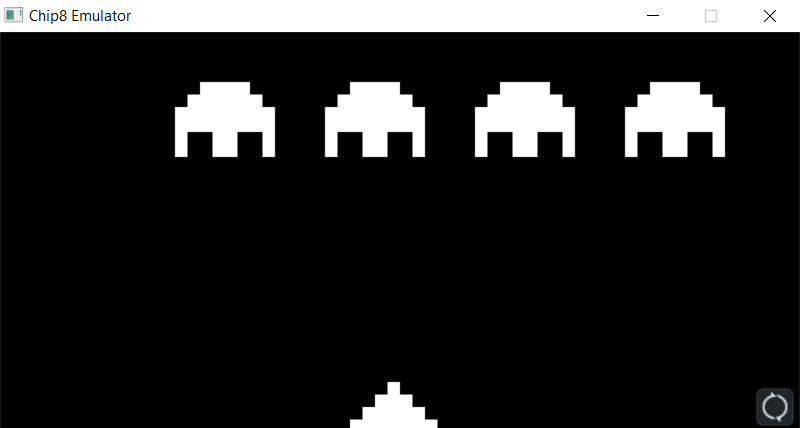
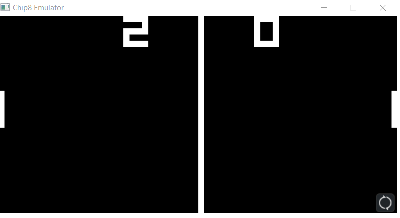
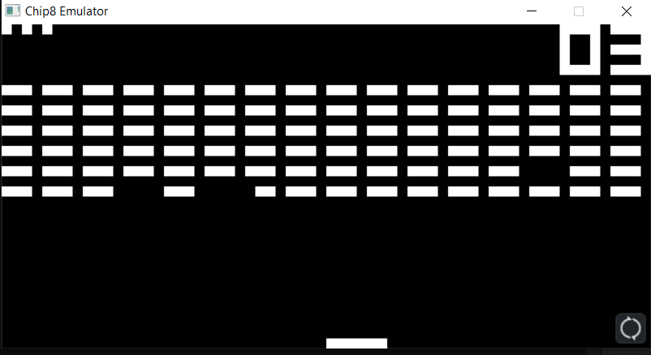

# CHIP-8-Emulator
CHIP-8 emulator implemented in C. C

CHIP-8 is an interpreted programming language, developed by Joseph Weisbecker. It was initially used on the COSMAC VIP and Telmac 1800 8-bit microcomputers in the mid-1970s. CHIP-8 programs are run on a CHIP-8 virtual machine. It was made to allow video games to be more easily programmed for these computers.

#### Screenshots

### *Space Invaders*

### *Pong*

### *Brix*

## References

- http://devernay.free.fr/hacks/chip8/C8TECH10.HTM#2.1
- http://en.wikipedia.org/wiki/CHIP-8
- Daniel McCarthy's Chip-8 guide
